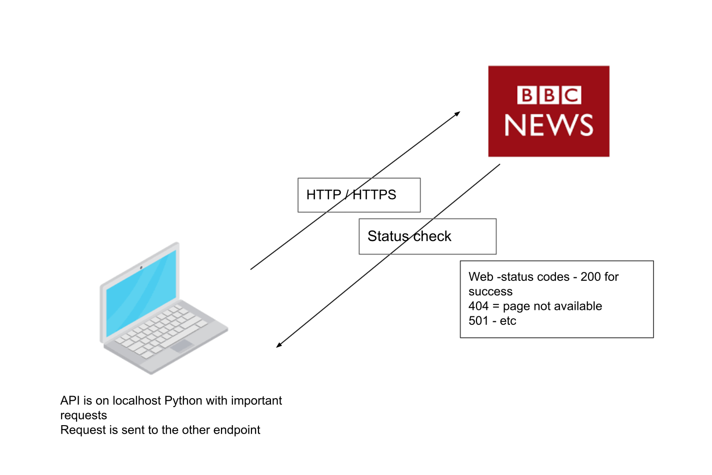

# Python API



### What is an API

### second iteration -
````python
import requests

response = requests.get("https://www.bbc.co.uk/iplayer/live/bbcnews") # API call to BBC to get response
#print(response)

if response: # what is it checking
    print("success")
elif response.status_code == 404: # what is it checking
    print("unsuccessfull")
    
else: # what is it checking
    print(f"fOOps something went wrong please try later the status code is {response.status_code}")
````

